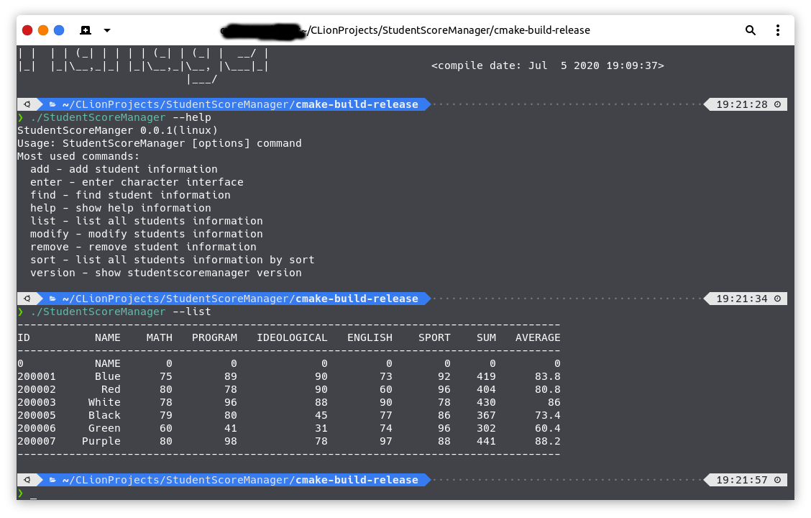

# 学生成绩管理系统

## 简介 

大一上的大作业，当时想写一个字符界面的，但是发现代码量太大，最后由于时间问题，字符界面写了一半，命令行写了一半。

## 截图

### 部分功能具体如下

| 功能      | 实现情况 |
| ----------- | ----------- |
| 字符界面账号相关操作 | 已实现  |
| 字符界面成绩相关信息操作 | 未实现 |
| 命令行成绩相关信息操作 | 已实现 |
| 命令行账号相关操作 | 未实现 |

## 头文件

### Check.h

#### Check类

##### 静态成员函数

`int input() //处理控制台输入指令`

`bool check_account_fm(const std::string&) //校验账号格式`

`bool check_password_fm(const std::string&) //校验密码格式`

`bool check_account_exist(const std::string&,const std::string&) //校验账号是否存在`

`bool match_password(const std::string &, const std::string &, const std::string &) //检查账号密码是否匹配`

### Coding.h

#### Coding类

##### 静态成员函数

`std::string base64_encode(unsigned char const *, unsigned int len) //base64编码`

`std::string base64_decode(std::string const &s) //base64解码` 

### Data.h

#### Data类

##### 静态成员函数

`void init() //初始化数据`

`void write_data(const std::string&,const std::string&) //写入数据`

`char *read_line(char* , int) //读取文件行数据`

`int get_file_line(const std::string&) //获取文件行数`

`void change_password(const std::string &, const std::string &,const std::string &) //更改账号密码 `

`void token(const std::string &, const std::string &) //写入当前登陆帐户令牌`

`int token_decode() //令牌解码`

`bool token_exist() //检验令牌是否存在`

`void token_remove() //令牌移除`

### Encryption.h

#### Encryption类

##### 静态成员函数

`void caesar(std::string &, int = 8) //凯撒加密` 

### Layout.h

#### Layout类

##### 静态成员函数

`void init() //初始化布局`

`void clear() //格式化布局`

`void page_top(const std::string &) //创建顶栏`

`void page_button(const std::string &, int, const std::string & = "none", int = -1) //创建按钮`

`void page_bottom(const std::string &) //创建底栏`

`void tip(int, const std::function<void(int)> &, int= 0) //创建提示区`

##### 成员函数

`void page_context(std::vector<std::string>, int= 0, bool=false) //创建文本列表`

### Protection.h

`void tempFile(const std::string&) //创建临时文件副本`

`void tempFileRemove(const std::string&) //移除临时文件副本`

`int captcha() //生成6位验证码`

### view.h

#### 函数

##### 未登录界面

`void welcome(int) //首次登录界面`

`void teacher_login_id(int) //教师登录界面`

`void teacher_login_success(int) //教师登录成功界面`

`void student_login_success(int) //学生登录成功界面`

`void student_login_id(int) //学生登录界面`

`void register_select(int) //注册界面`

`void teacher_register(int) //教师注册界面`

`void teacher_register_success(int) //教师注册成功界面`

`void student_register(int) //学生注册界面`

`void student_register_success(int) //学生注册成功界面`

`void forget_pw(int) //忘记密码界面`

`void teacher_forget_pw(int) //教师找回密码界面`

`void teacher_get_back_pw_success(int) //教师找回密码成功界面`

`void student_forget_pw(int) //学生找回密码界面`

`void student_get_back_pw_success(int) //学生找回密码成功界面`

`void welcome_exit(int) //退出界面`

